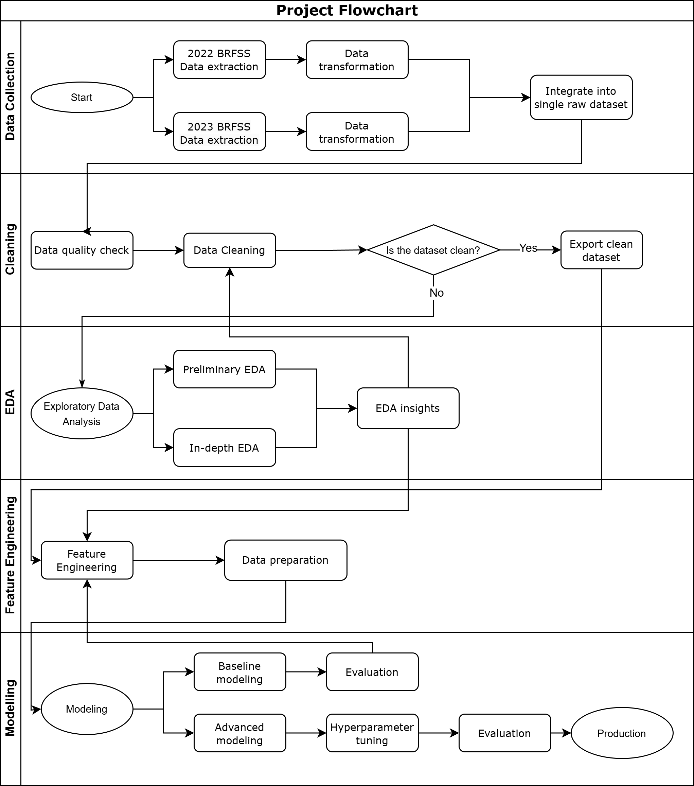

  

## Project Introduction

This project aims to build a heart attack risk prediction model that utilizes accessible and feasible features (physical condition, lifestyle, medical history, etc).

## Table of Contents

- [References to Analysis](#references-to-analysis)
- [Project Overview](#project-overview)
- [Data Science Solutions](#data-science-solutions)
- [Metrics of Success](#metrics-of-success)
- [Project Organization](#project-organization)
- [Project Flowchart](#project-flowchart)
- [Dataset Description](#dataset-description)
- [Data Dictionary](#data-dictionary)

## References to Analysis
For those who wish to deepen their understanding of the processes and findings in Exploratory Data Analysis, Modeling, and Evaluation, please refer to the links below for direct access to Jupyter Notebooks
1. [introduction_data_import_cleaning_heart_attack_prediction_book1](notebooks/introduction_data_import_cleaning_heart_attack_prediction_book1.ipynb)
2. [EDA_cleaning_stage2_heart_attack_prediction_book2](notebooks/EDA_cleaning_stage2_heart_attack_prediction_book2.ipynb)
3. [feature_engineering_baseline_modeling_book3](notebooks/feature_engineering_baseline_modeling_book3.ipynb)

Appendix: 
1. [Appendix_data_extraction_transformation_2022_BFRSS_survey](notebooks/Appendix_data_extraction_transformation_2022_BFRSS_survey.ipynb)
2. [Appendix_data_extraction_transformation_2023_BFRSS_survey](notebooks/Appendix_data_extraction_transformation_2023_BFRSS_survey.ipynb)

## Project Overview
- **Motivation:** 
My interest in this project is deeply personal; having lost my uncle to cardiac arrest and witnessing family members affected by cardiac disease, I often feel anxious about my own risk of having a heart attack, especially during times of high stress, lack of sleep, or insufficient exercise. This experience drives my eagerness to develop a model that can identify individuals at risk of heart attacks, thereby enabling proactive health management.

- **Problem Description:**  
Heart attacks are a leading cause of death worldwide, resulting in long-term health issues and substantial financial costs. Current risk assessment tools are limited by their reliance on blood test results and constraints such as the user’s age, which restricts the opportunity to identify individuals at risk of having a heart attack. This project aims to create a more user-friendly and accessible heart attack risk assessment model using readily available features.

- **Affected Groups:**  
According to the CDC, approximately 805,000 people in the U.S. experience a heart attack each year, translating to someone suffering a heart attack every 40 seconds. This number underscores a staggering reality: many more people could be suffering from heart attacks when considering global population and undiagnosed cases. Common signs include chest discomfort, shortness of breath, upper body discomfort, and light-headedness. Symptoms can be subtle, particularly in women, who may experience non-painful signs such as fatigue or nausea, which can lead to delays in seeking emergency care. Therefore, it is crucial for individuals to be aware of their heart attack risk and stay vigilant for any relevant symptoms.

## Data Science Solution

- **Solution Overview:** 
The project aims to develop an early detection model that identifies whether a user is at risk of having a heart attack. The model will utilize accessible features, including basic physical conditions, lifestyle habits, medical history, and vaccination history.
- **Existing Solutions Drawbacks:** 
Multiple approaches have been developed to assist healthcare providers in assessing the risk of cardiovascular disease. Atherosclerotic Cardiovascular Disease [(ASCVD) Risk Calculator](https://tools.acc.org/ascvd-risk-estimator-plus/#!/calculate/estimate/) assesses the chances of a person aged 40 to 79 developing heart disease over the next 10 years. Similarly, [The American Heart Association Prevent Online Calculator](https://professional.heart.org/en/guidelines-and-statements/prevent-calculator) assesses the risk of heart failure for users aged 30 to 79. 
However, these models impose age restrictions, preventing individuals under 30 or over 80 from accessing them, and they require specific information, such as HDL cholesterol levels, which can only be obtained through blood tests, making these calculators not readily accessible tools.  
One interesting finding during the exploratory data analysis is that age is exponentially correlated with the risk of heart attack; in fact, individuals aged 80 and above have the highest likelihood of experiencing a heart attack among all age groups. Consequently, the most vulnerable population lacks access to the most needed early detection model, emphasizing the necessity of this project.

 - **Machine Learning Solutions:**  
This project will employ various machine learning classifiers to identify individuals at risk of having a heart attack. The classification model will make binary predictions ('Yes'/'No) regarding whether the user is likely to face a heart attack.

- **Expected Outcomes and Impact:**  
The model is designed to be accessible anytime, anywhere, allowing users to promptly identify their risk of heart attacks. Increased awareness of heart attack symptoms could lead to quicker responses during emergencies, ultimately saving lives. Even a modest reduction in heart attack incidents, such as 1%, could help over 8,000 individuals avoid experiencing a heart attack. With the average healthcare costs associated with heart attacks estimated at over $20,000, this could result in annual savings of approximately $161 million.

## Metrics of Success
- **Business Metrics:** 
1. The goal of this project is to develop a model that accurately identifies individuals at risk of a heart attack. 
2. Research indicates that approximately 80-90% of heart attacks are linked to modifiable risk factors, including tobacco use, physical inactivity, and obesity. This leaves 10-20% of heart attacks attributed to genetics or other difficult-to-measure variables such as psychosocial stress.

- **Imbalanced Data Consideration:** 
Due to the severely imbalanced distribution of the target variable (94.7% negative vs. 5.3% positive), accuracy is not a suitable metric. A classifier predicting all instances as negative would achieve 94.7% accuracy but fail to detect any positive cases.

- **Modeling Metrics:** 
1. The **primary objective** is to achieve a **high recall score of 0.8-0.9**, which is crucial for timely identification of true positive cases.
2. A **low false positive rate** is the **secondary goal**. High recall may lead to many false positives, incorrectly flagging low-risk individuals as high-risk, resulting in unnecessary medical interventions and compromising the model’s reliability.

## Project Organization

**Repository :** 
* `data` 
    - contains link to the datasource (stored in a publicly accessible cloud storage)
    - saved copy of raw and processed data as long as those are not too large 

* `model`
    - `joblib` dump of final model(s)

* `notebooks`
    - contains all final notebooks involved in the project

* `docs`
    - Final report, presentations, variable descriptions, and relevant documentation for README and presentations

* `references`
    - Papers and tutorials utilized in the projectPapers and tutorials utilized in the project

* `src`
    - Contains the project source code (refactored from the notebooks)

* `.gitignore`
    - Part of Git, includes files and folders to be ignored by Git version control

* `environment.yml`
    - Conda environment specification

* `README.md`
    - Project landing page (this page)

* `LICENSE`
    - Project license

## Project Flowchart

This project is divided into five main steps:
- **Data Collection:**  
  1. Data Extraction: Collect and transform multiple datasets, preprocessing the raw data to ensure it can be effectively imported and analyzed.
  2. Data integration: Combine multiple datasets into a single raw file.
- **Data Cleaning:**  
  1. Conduct data quality checks.
  1. Rename columns and categories.
  2. Address missing values: Multiple rounds of cleaning and imputation to handle missing data effectively.
  3. Remove duplicate values.
- **Exploratory Data Analysis (EDA):**  
  1. Analyze the target variable.
  2. Examine features and their correlation with the probability of having a heart attack.
  3. Investigate missing values, providing insights into their causes and appropriate imputation methods.
- **Feature Engineering:**  
  1. Feature selection.
  2. Feature transformation: Bin numerical features into categories and normalize non-normal features.
  3. Apply One-Hot Encoding.
  4. Perform feature scaling.
  5. Address class imbalance through upsampling and downsampling.
  6. Apply dimensionality reduction techniques, such as PCA.
- **Modeling and Evaluation:**  
  1. Baseline modeling: Train baseline models including Logistic Regression, Naive Bayes, Decision Tree, Randorm Forest, XGBoost, Neural Network
  2. Baseline model evalution: Evaluate baseline models with various metrics, including recall and false positive rate, etc. Compare performance of different models, and generate insights for additional feature engineering.
  3. Advanced modeling: Train models after additional feature engineering, perform hyperparameter tuning and grid search for optimization. Create customized loss function for Neural network model.
  4. Final model evaluation: Perform in-depth evaluation of the final model, analyze model limitations if exhibited.

## Dataset Description

- **Source of the Dataset:**  
The dataset for this project is sourced from the Centers for Disease Control and Prevention (CDC) Behavioral Risk Factor Surveillance System (BRFSS). This program conducts over 400,000 adult interviews each year through telephone surveys to gather comprehensive data on the health status and risk behaviors of U.S. residents. 
For this project, we utilize two specific datasets: 
1. [2022 BRFSS Survey Data and Documentation](https://www.cdc.gov/brfss/annual_data/annual_2022.html): This dataset includes information from the 2022 survey, detailing various health-related behaviors, conditions, and demographic factors.
2. [2023 BRFSS Survey Data and Documentation](https://www.cdc.gov/brfss/annual_data/annual_2023.html): This dataset features the latest survey data from 2023, further enriching our analysis with updated health information.

- **Overview of Dataset:**  
The 2022 BFRSS Survey dataset includes 445,132 observations and the 2023 BFRSS Survey dataset includes 433,323 observations. 
Both datasets contain various features structured as follows:
  - **Target Variable**: `had_heart_attack` (categorical, binary)
  - **Features**: 31 categorical variables, and 6 numerical variables

## Data Dictionary
The values within each variable reflect the respondents' answers to the corresponding questions.

### Field of Interest
| Variable                     | Description                                         | Data Type     |
|:----------------------------|:---------------------------------------------------|:-------------|
| `had_heart_attack`           | (Ever told) you had a heart attack? | Categorical   |

#### Interviewee's Basic Information
| Variable                     | Description                                         | Data Type     |
|:----------------------------|:---------------------------------------------------|:-------------|
| `year`    | Year which observation was recorded                             | Numeric   |
| `sex`                        | Sex of respondent                                   | Categorical   |
| `race_ethnicity_category`    | Race/ethnicity category                             | Categorical   |
| `age_category`               | Age category                                       | Categorical   |
| `state`                      | States in U.S. where respondent resides            | Categorical   |
| `height`          | Reported height in meters                           | Numeric       |
| `weight`       | Reported weight in kilograms                        | Numeric       |
| `bmi`                        | Body Mass Index                                     | Numeric       |

#### Health and Lifestyle Information
| Variable                     | Description                                         | Data Type     |
|:----------------------------|:---------------------------------------------------|:-------------|
| `alcohol_drinkers`          | Adults who reported at least one drink in 30 days | Categorical   |
| `general_health`            | Respondent's general health condition                | Categorical   |
| `smoker_status`             | Respondent's smoking status                         | Categorical   |
| `e_cigarette_usage`         | Respondent's e-cigarette usage status              | Categorical   |
| `physical_activities`       | Participation in physical activities in the past month              | Categorical   |
| `physical_health_days`      | Poor physical health days in past 30 days         | Categorical   |
| `mental_health_days`        | Poor mental health days in past 30 days           | Categorical   |
| `stress_levels`        | How often does respondents feel stress in past 30 days         | Categorical   |

#### Medical History: 
| Variable                     | Description                                         | Data Type     |
|:----------------------------|:---------------------------------------------------|:-------------|
| `had_angina`                | (Ever told) had angina or coronary heart disease?  | Categorical   |
| `had_stroke`                | (Ever told) had a stroke                           | Categorical   |
| `had_asthma`                | (Ever told) had asthma                             | Categorical   |
| `had_skin_cancer`           | (Ever told) had non-melanoma skin cancer          | Categorical   |
| `had_copd`                  | (Ever told) had COPD or related diseases           | Categorical   |
| `had_diabetes`              | (Ever told) had diabetes                           | Categorical   |
| `had_kidney_disease`        | (Ever told) had kidney disease (not stones)       | Categorical   |
| `had_depressive_disorder`    | (Ever told) had a depressive disorder              | Categorical   |
| `had_arthritis`              | (Ever told) had some form of arthritis             | Categorical   |
| `deaf_or_hard_of_hearing`   | Deaf or serious difficulty hearing                  | Categorical   |
| `blind_or_vision_difficulty` | Blind or serious difficulty seeing                  | Categorical   |
| `difficulty_walking`        | Serious difficulty walking or climbing stairs       | Categorical   |
| `difficulty_concentrating`   | Difficulty concentrating due to physical or mental conditions | Categorical   |
| `difficulty_dressing_bathing`| Difficulty dressing or bathing                      | Categorical   |
| `difficulty_errands`        | Difficulty doing errands due to physical or mental conditions | Categorical   |

#### Health Assessment Information
| Variable                     | Description                                         | Data Type     |
|:----------------------------|:---------------------------------------------------|:-------------|
| `last_checkup_time`         | Time since last routine checkup                    | Categorical   |
| `chest_scan`                | Have you ever had a CT or CAT scan of your chest? | Categorical   |

#### Vaccination and Drug Use
| Variable                     | Description                                         | Data Type     |
|:----------------------------|:---------------------------------------------------|:-------------|
| `flu_vax`           | Received flu vaccine in the past 12 months         | Categorical   |
| `tetanus_vax`      | Received a tetanus shot in the past 10 years       | Categorical   |
| `pneumo_vax`           | Ever had a pneumonia shot                           | Categorical   |

